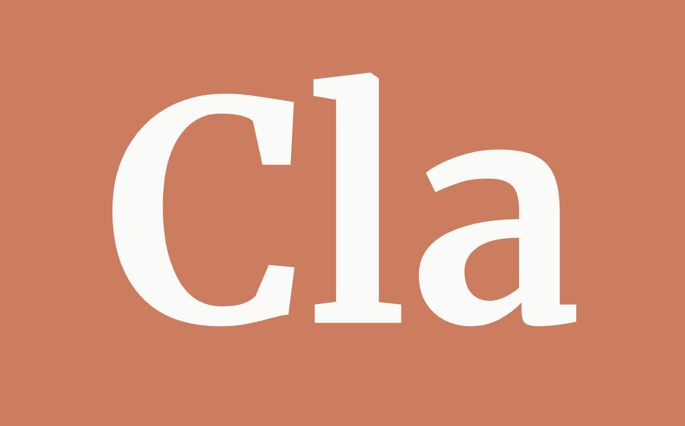

<p align="center">
    
</p>

## ⚠️ Deprecation Notice

As of July 27, 2024, the Cla project (this repository) has been deprecated and will no longer be supported or maintained. You are welcome to fork this project and continue development independently. The [Cha](https://github.com/MehmetMHY/cha) project will continue to be actively maintained.

## About

A simple CLI chat tool designed for easy interaction with Anthropic's LLM models. Cla is based on the [Cha](https://github.com/MehmetMHY/cha) project. Check out the demo [HERE](https://x.com/mehmet_mhy/status/1806670338908209352).

## Alternatives

If you want to use OpenAI's models in the CLI, check out [Cha](https://github.com/MehmetMHY/cha)!

## Tests

If you are developing Cla and also want to ensure certain web scraper components are working correctly, as web pages change over time, make sure to run Cla's unit tests before making any commits and periodically:

```bash
python -m unittest discover -s tests
```

Or, if you don't want to enter this command every time, run the following command:

```bash
bash tests/run.sh
```

## Setup

1. Get your Anthropic API key. Follow [this tutorial](https://docs.anthropic.com/en/docs/quickstart).
    - Check out your Anthropic console [here](https://docs.anthropic.com/en/docs/console.anthropic.com)
    - Check out/get your API key(s) [here](https://console.anthropic.com/settings/keys)

2. Create a `.env` file in the root directory and add the following to it:
    ```env
    export ANTHROPIC_API_KEY="YOUR_KEY_HERE"
    ```

3. Ensure you have Python and pip installed. Then install the tool's dependencies:
    ```bash
    pip3 install --upgrade .
    ```

4. Source your environment variables:
    ```bash
    source .env
    ```

5. To start the tool, execute:
    ```bash
    cla
    ```

## (Optional) Setup `claude` Command

For easier use of `cla`, you can use the `cla.sh` script. Add the script to your main shell file (`.bashrc`, `.zshrc`, etc.):

```bash
# if using a zsh shell
cat cla.sh >> $HOME/.zshrc

# if using a bash shell
cat cla.sh >> $HOME/.bashrc
```

After copying the content from `cla.sh` to your shell's main config file, modify the `ANTHROPIC_API_KEY` variable to be equal to the Anthropic API key you grabbed earlier.

```bash
export ANTHROPIC_API_KEY="YOUR_KEY_HERE"
```

Finally, open a new terminal instance and run the command in `cla.sh`:

```bash
claude
```

## Develop Mode

For developing `cla`, you can do the following:

1. Install `cla` in editable mode so that pip points to the source files of the cloned code:

    ```bash
    pip install -e .
    ```

2. Make changes to the code, then run `cla` to try out your changes.

3. If you add a new dependency, you will have to do step 1 again.

## Other Notes

- To see and/or change hard-coded config variables/logic in `cla`, check out the `config.py` file.

## Credits

- [Anthropic Documentation](https://docs.anthropic.com/)
- [Cha](https://github.com/MehmetMHY/cha)
- [ChatGPT (GPT-4)](https://chat.openai.com/)

